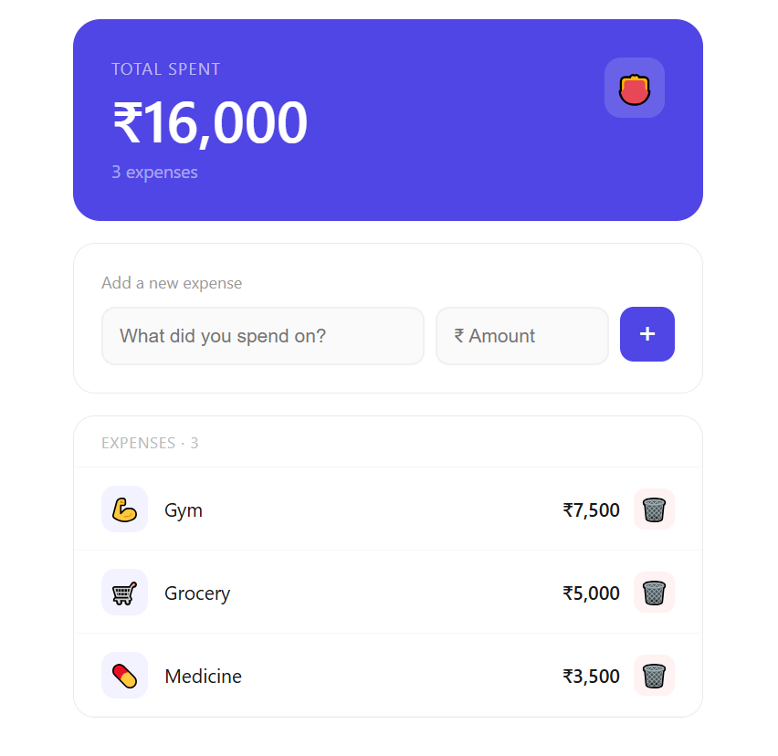

# Expense Tracker

A clean, minimal expense tracking app built with React. Add your daily expenses, see the total instantly, and delete entries when done.

**Live Demo → [react-expense-tracker-umber.vercel.app](https://react-expense-tracker-umber.vercel.app)**



## Features

- Add expenses with a name and amount
- Auto-assigns an icon based on the expense type (food, travel, rent, etc.)
- Running total updates in real time
- Delete any expense instantly
- Indian number formatting (₹ with en-IN locale)
- Press Enter to add — no need to click

## Built With

- React.js
- JavaScript (ES6+)
- CSS-in-JS (inline styles)

## Getting Started

### Prerequisites

Make sure you have Node.js installed. You can download it from [nodejs.org](https://nodejs.org).

### Installation

1. Clone the repository

   ```bash
   git clone https://github.com/KoyanaSingh/React-Expense-Tracker.git
   ```

2. Navigate into the project folder

   ```bash
   cd React-Expense-Tracker
   ```

3. Install dependencies

   ```bash
   npm install
   ```

4. Start the development server
   ```bash
   npm start
   ```

The app will open at `http://localhost:3000`

## Project Structure

```
src/
└── App.js        # Main component — all logic and UI lives here
public/
└── index.html    # HTML template
```

## What I Learned

- Managing state with `useState` in React
- Handling lists — adding, rendering, and deleting items from state
- Deriving values (total) from state without storing them separately
- Basic React event handling (`onClick`, `onChange`, `onKeyDown`)

## Author

**Koyana Singh**

- GitHub: [@KoyanaSingh](https://github.com/KoyanaSingh)
- LinkedIn: [koyana-singh](https://linkedin.com/in/koyana-singh)

---

_This is a personal project built to practise React fundamentals._
